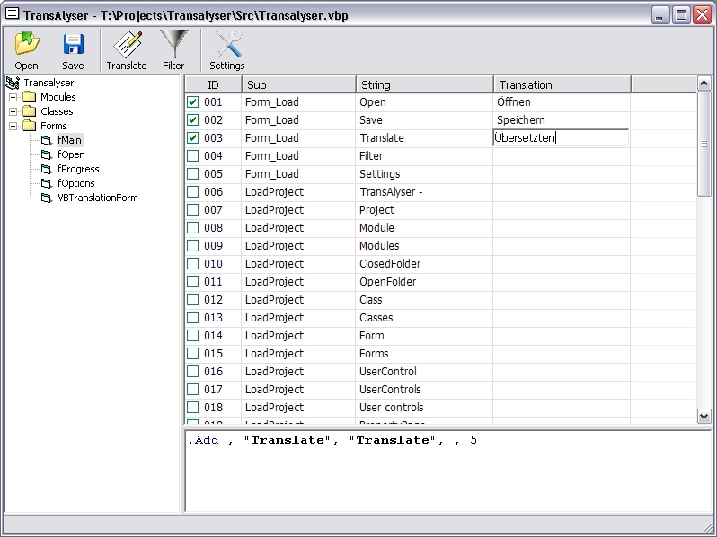



## Half Automatic VB6 Application Translator / 'TansAlyser'

### Description

This VB6 Tool makes translation of EXISTING single language applications much more easy.

Is full automatically scans your .vbp project file and all included forms, modules, classes and so on for all strings within your code and even for control captions that are not visible in the code window.

Than it displays all strings within a grid view which allows easy and fast translation of your projects even for people that are not familiar with programming at all.

Last but no least it finally can create (almost) all necessary code changes on its own and saves the translated files to a new directory!

(Actually this code was written by me as a full blown(!) VB6 Obfuscator - but that code was adapted to serve a more useful purpose now ;-)
 
### More Info
 

             |
---                |---
**Submitted On**   |2010-05-22 18:52:58
**By**             |[c0rt3x](https://github.com/Planet-Source-Code/PSCIndex/blob/master/ByAuthor/c0rt3x.md)
**Level**          |Advanced
**User Rating**    |5.0 (10 globes from 2 users)
**Compatibility**  |VB 6\.0
**Category**       |[Complete Applications](https://github.com/Planet-Source-Code/PSCIndex/blob/master/ByCategory/complete-applications__1-27.md)
**World**          |[Visual Basic](https://github.com/Planet-Source-Code/PSCIndex/blob/master/ByWorld/visual-basic.md)
**Archive File**   |[Half\_Autom219942392011\.zip](https://github.com/Planet-Source-Code/c0rt3x-half-automatic-vb6-application-translator-tansalyser__1-73786/archive/master.zip)

